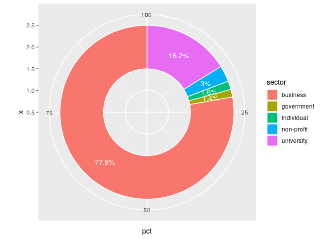

Graphs for 2019 poster
================
Cong Cong, Calvin Isch, Eliza Tobin
2019-08-07

Plot1: Repositories created each year
-------------------------------------

``` r
data <- fread("./data/oss/final/Github/all_repos_commits.csv")
finalTable <- data %>% group_by(year=year_repo) %>% summarize(repoNum=n()/1000000)

##make chart
p <-  ggplot(data=finalTable, aes(x=year, y=repoNum)) +
  geom_bar(stat="identity", fill = "#232D4B")+
  theme(plot.title = (element_text("Amount of Repositories Created per Year in Millions", colour="#232D4B", hjust = .5, size = 15)),
        panel.background = element_rect(fill = "white", colour = "white",
                                        size = 2, linetype = "solid"),
        panel.grid.major = element_line(size = 0.5, linetype = 'solid',
                                        colour = "white"),
        panel.grid.minor = element_line(size = 0.25, linetype = 'solid',
                                        colour = "white"),
        axis.text.x=element_text(colour="#232D4B", size = 12),
        axis.text.y=element_text(colour="#232D4B", size = 12),
        axis.title = element_text(colour="#232D4B", size = 15)
  )
p + labs(title="Amount of Repositories Created per Year in Millions",
         x="Year", y = "Amount in Millions")
```


Plot2: Change of proportions of different OSS licenses
------------------------------------------------------

``` r
# Get all licenses from 2018
all_year3 <- data %>% filter(year_repo=="2018")
#all_year3$repo_slug <- paste(all_year3$login,"/",all_year3$reponame,sep="")
all_year3 <- all_year3 %>%
  select(repo_slug,license)
all_year3$year_repo <- "2018"
unique_year3 <- unique(all_year3)

# and 2012
all_year <- data %>% filter(year_repo=="2012")
#all_year$repo_slug <- paste(all_year$login,"/",all_year$reponame,sep="")
all_year <- all_year %>%
  select(repo_slug,license)
all_year$year_repo <- "2012"
unique_year <- unique(all_year)

# combine to usable format
a<- table(unique_year$license)
a <- data.table(a)
a <- a[a$V1 %chin% c("MIT","GPL-3.0","Apache-2.0","BSD-3-Clause","GPL-2.0")]
a$percent <- a$N / sum(a$N)
a$year <- 2012
b<- table(unique_year3$license)
b <- data.table(b)
b <- b[b$V1 %chin% a$V1]
b$percent <- b$N / sum(b$N)
b$year <- 2018
licenseBreakdown <- rbindlist(list(a,b))
licensesNice <- data.frame( Year = as.factor(licenseBreakdown$year),
                            licenses = as.factor(licenseBreakdown$V1),
                            Percent = as.numeric(round(licenseBreakdown$percent * 100,2)))

# Plot it
ggplot(data = licensesNice, aes(x = Year, y = Percent, group = licenses)) +
  geom_line(aes(color = licenses), size = 2) +
  scale_color_manual(values=c("#5ebdc8","#dadada","#242c49","#abd4a8","#d7762c")) +
  geom_point(aes(color = licenses), size = 4) +
  #  Labelling as desired
  scale_x_discrete(position = "top") +
  theme_bw() +
  theme(panel.border = element_blank()) +
  theme(panel.grid.major.x = element_blank()) +
  theme(panel.grid.major.y = element_blank()) +
  theme(panel.grid.minor.y = element_blank()) +
  theme(axis.ticks       = element_blank()) +
  labs(
    title = "Change in Open Source License Proportion, 2012-2018",
    caption = "based on a query of the top 5 OSS licenses on Github"
  )
```


Plot3: Lollipop chart of top five shares
----------------------------------------

``` r
test <- data %>% group_by(repo_slug,license) 
count <- table(test$license) %>% data.frame() %>% arrange(desc(Freq))
sum(count$Freq)
```

    ## [1] 9593592

``` r
toplicenses.df <- count[c(1:5),]
colnames(toplicenses.df) <- c("License","Count")
toplicenses.df$Percent <- toplicenses.df$Count*100/sum(count$Freq)

ggplot(data=toplicenses.df, aes(x=reorder(License,-Percent), y=Percent,ymax=100)) +
  geom_segment(aes(x=reorder(License,-Percent), xend=reorder(License,-Percent), y=0, yend=Percent), color="#232D4B",lwd = 1) +
  geom_point(shape = 21, colour = "black", fill = "#FA7D24", size = 5, stroke = 1) +
  theme_light() +
  coord_flip() +
  theme(strip.text=element_text(size=16, face="bold"),
        axis.text.x=element_text(size=12),
        axis.text.y=element_text(size=12),
        axis.title.x = element_text(size=14),
        axis.title.y = element_text(size=14)) +
  xlab("License") + 
  ylab("Percent") 
```


Plot4: Contributors per repo
----------------------------

``` r
# define the color used
uva_colors <- c(
  `blue`        = "#232D4B",
  `orange`      = "#E57200",
  `turquoise` = "#2FBFCA",
  `aqua` = "#A0D5A4",
  `red` = "#DF1E43",
  `medium grey`  = "#DADADA",
  `text grey` = "#666666")
# a function that extracts the hex codes from this vector by name
uva_cols <- function(...) {
  cols <- c(...)

  if (is.null(cols))
    return (uva_colors)

  uva_colors[cols]
}

# average repos per contributor
repo <- table(data$repo_slug) %>% data.frame() 
#repo$Log <- log10(repo$Freq)

# set up boundaries for intervals/bins
breaks <- c(0,2,3,4,10,50,200,1000,100000)
# specify interval/bin labels
labels <- c("1", "[2-3)","[3-4)" ,"[4-10)", "[10-50)", "[50-200)","[200-1,000)",">=1,000")
# bucketing data points into bins
bins <- cut(repo$Freq, breaks, include.lowest = T, right=FALSE, labels = labels)
# inspect bins
summary(bins)
```

    ##           1       [2-3)       [3-4)      [4-10)     [10-50)    [50-200) 
    ##     2387804     1809747      417337      287345       36673        1730 
    ## [200-1,000)     >=1,000 
    ##         145           7

``` r
# make a barplot that looks like a histogram
barplot(summary(bins))
```


``` r
# make a dataframe to make it easier to plot
df <- cbind.data.frame(c("1 or 2 contributors (48%)","3 contributors (37%)","4 (8%)","5-10 (6%)","11-50 (0.7%)","50-200","200-1,000",">=1,000"),as.numeric(as.character(summary(bins))))
colnames(df) <- c("contributors","freq")

#ggplot(df) +
  aes(x = contributors, y = freq, fill="orange") +
  geom_col() + theme_bw()
```

    ## NULL

``` r
pal <- c(uva_cols("orange"),uva_cols("blue"),  uva_cols("turquoise"), uva_cols("aqua"),uva_cols("red"),uva_cols("medium grey"))
treemap(df, index="contributors", vSize="freq",palette = pal, title="Number of contributors per repository",fontsize.labels=c(15,15,12,12,10,8,8,8),fontsize.title=18)
```


Plot4: Contributors by sectors
------------------------------

``` r
company <- unique(data$company) %>% data.frame() 
colnames(company) <- "name"

## These patterns can be improved, right now they are directly borrowed from the copyright identification.
match2 <- company %>% mutate(business = str_detect(string = name,                        pattern ="(?i)(corp|.?com|llp|inc.j|corporation)\\.?$|(lc.|Group|Entertainment|Computing|Software)$|Service.*|Consulting|Consultants|Business|Laboratories|Technologies|Technology|Bank|Company|Studios|Solutions|inc.|l\\.?l\\.?c.?|ltd|employer|Systems|System|Limited|Publishing"))%>%
  mutate(nonprofit = str_detect(string = name,
                               pattern ="(?i)association|foundation|fund|board of realtors|assoc.|society|societies|organization|board|.org$") & business==FALSE)%>%
  mutate(government = str_detect(string = name,
                               pattern = "(?i)government|authority|council|department|commission|office|county|administration|.gov$") & business == FALSE & nonprofit == FALSE)%>%
  mutate(university = str_detect(string = name,
                               pattern = "(?i)university|academy|college|school|institute|research|.edu$|student") & business == FALSE & nonprofit == FALSE & government ==FALSE)%>%
  mutate(individual = str_detect(string = name,pattern ="(?i)(, \\d{4}-|pseud|Jr.|Sr.|2nd)") & business == FALSE & nonprofit == FALSE & government == FALSE & university == FALSE)%>%
  mutate(identified = business | nonprofit | government | university | individual)
```

How many are identified:

``` r
result <- data.table(missing = sum(data$company=="", na.rm = TRUE)+sum(is.na(data$company)),
           matched = sum(match2$identified,na.rm = TRUE))
result$unidentified=nrow(data)-result$missing-result$matched
result<- result[ , c(1,3,2)]
result <- rbind(result, round(result*100/nrow(data),3))
cbind(c("number","percent"),result)
```

    ##         V1     missing unidentified   matched
    ## 1:  number 7587044.000  1947689.000 64048.000
    ## 2: percent      79.042       20.291     0.667

Of all the identified copyright claimants, 26.7% are from the business sector. The break down of sectors are shown as follows:

``` r
df <- cbind.data.frame(c("business","government","non-profit","university","individual"),c(length(which(match2$business)),length(which(match2$government)),length(which(match2$nonprofit)),length(which(match2$university)),length(which(match2$individual))))
            
colnames(df)<-c("sector","count")
df$pct<-100*round(as.numeric(as.character(df$count))/(nrow(match2)-length(which(match2$identified))),3)
df%>% knitr::kable()
```

| sector     |  count|   pct|
|:-----------|------:|-----:|
| business   |  49866|  26.7|
| government |    908|   0.5|
| non-profit |   1893|   1.0|
| university |  10368|   5.6|
| individual |   1013|   0.5|

``` r
ggplot(df, aes(x = 2, y = pct, fill=sector)) +
    geom_bar(width = 1, stat = "identity", color = "white") +
    coord_polar("y",start = 0)+
    geom_text(aes(y = pct, label = paste0(round(pct,2),"%")), color = "white",position = position_stack(vjust = 0.5))+
    xlim(0.5, 2.5)
```


